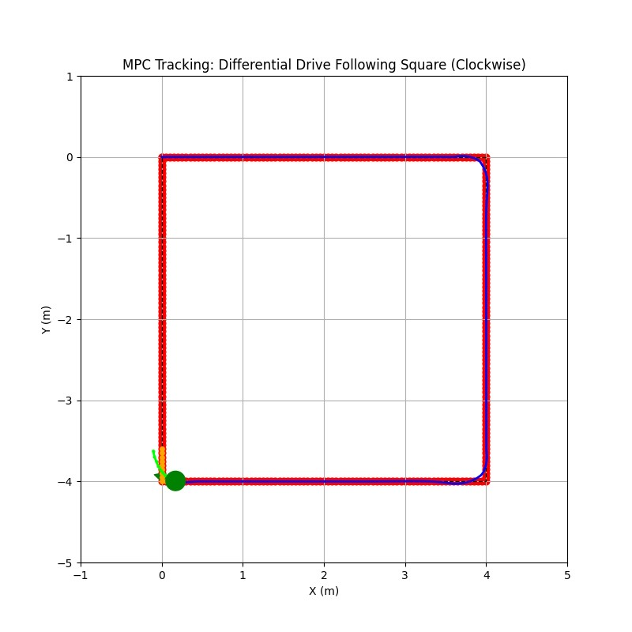

# CtRL: Control and Reinforcement Learning for Robotics

> Bilibili 课堂：[五大项目实战！机器人智能控制与规划](https://www.bilibili.com/cheese/play/ss959816966)

## 项目总览

|                    [EKF SLAM](./ch1_ekf_slam/)                    |                    [LQR Cartpole](./ch2_lqr_cartpole/)                    |   [Trajectory Optimization](./ch4_traj_opt/)   |         [MPC Tracking](./ch3_mpc_tracking/)          |          [DQN Cartpole](./ch5_dqn_cartpole/)           |
| :---------------------------------------------------------------: | :-----------------------------------------------------------------------: | :--------------------------------------------: | :--------------------------------------------------: | :----------------------------------------------------: |
|  |  |  |  |  |
